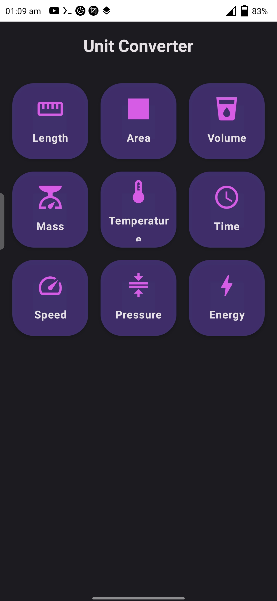
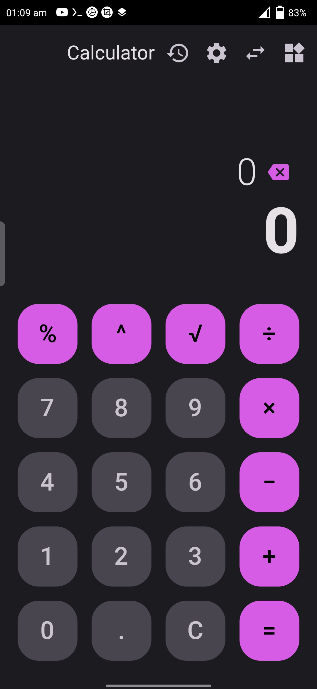
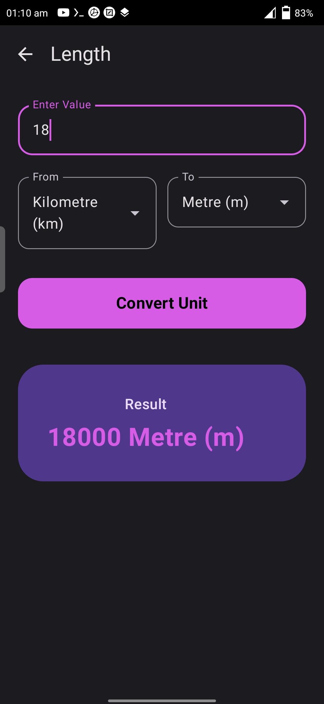
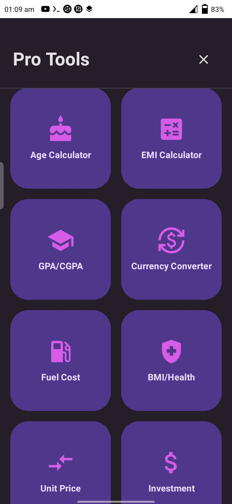

#  Neo-Calculator (Premium)

> **A professional-grade, multi-functional utility suite with a futuristic UI.**

**Neo-Calculator** is not just a calculation tool; it's a comprehensive "Pro Tools" ecosystem built with modern Android standards. From advanced unit conversions to real-time health and investment tracking, it provides a seamless experience with a highly customizable Glassmorphism interface.

---

### 📱 App Interface
Check out the premium look of Neo-Calculator:

| Main Calculator | Pro Tools Grid | Theme Settings | Unit Converter |
| :---: | :---: | :---: | :---: |
|  |  |  |  |

---

### 🚀 Key Modules
Neo-Calculator comes packed with specialized tools for every need:

* **🧮 Core Calculator:** Supports advanced equations, haptic feedback, and custom decimal precision.
* **🛠️ Pro Tools Suite:** * *Financial:* EMI, Investment, and Unit Price calculators.
    * *Academic:* GPA/CGPA tracker for students.
    * *Daily Utility:* Age, Fuel Cost, and Currency Converter.
    * *Health:* Advanced BMI & Health tracking.
* **📏 Unit Converter:** Comprehensive conversion for Length, Area, Volume, Mass, Pressure, Energy, and more.
* **🎨 Dynamic Theming:** Real-time **Hue Rotation** allow users to pick any primary color they desire.

---

### 🛠️ Technical Architecture
Built with the latest Android stack for stability and speed:
* **Language:** 100% Kotlin
* **UI Framework:** Jetpack Compose (Declarative UI)
* **Dependency Injection:** Hilt (`AppModule.kt`)
* **Navigation:** Type-safe Navigation Graph (`NavGraph.kt`)
* **Database:** Room Persistence Library for history management.
* **Architecture:** MVVM (Model-View-ViewModel) for clean separation of concerns.

---

### 📦 Installation & Build
This project uses **GitHub Actions** for automated CI/CD.
1.  Go to the **Actions** tab in this repository.
2.  Download the **`Neo-Calculator-Signed`** artifact from the latest successful build.
3.  Install the APK on your Android device (supports Android 8.0+).

---

### 👨‍💻 Developed By
**Neo-Dev-Labs** *“Innovating everyday tools through code.”*

---

