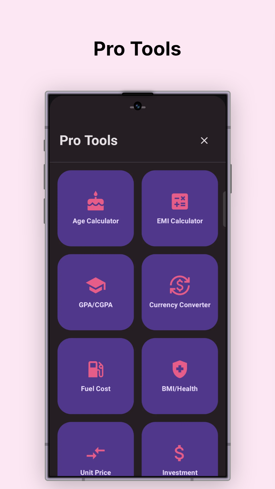
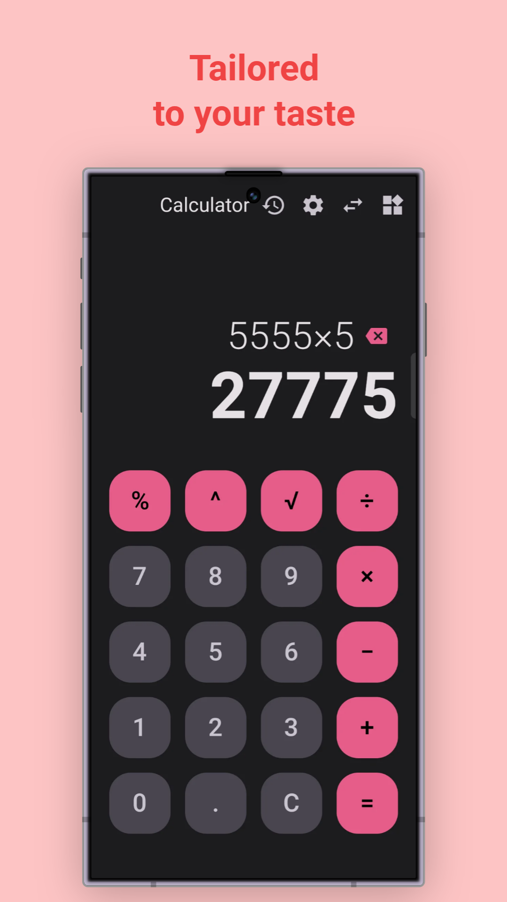

#  Neo-Calculator

  
  
  

**Neo-Calculator** is a high-performance, all-in-one utility suite. From basic arithmetic to massive astronomical computations, it handles everything with precision and style.

---

### 📱 App Interface

  
  
  
  

### 🚀 Key Modules

* **🔢 Advanced Math Engine:** Capable of calculating massive factorials (up to **10,000!**) with infinite precision.
* **⚖️ Unit Converter:** Comprehensive tools for Length, Weight, Data, and Temperature.
* **🏥 Health & Finance:** Built-in BMI calculator, Age tracker, and Currency tools.
* **🎨 Premium Aesthetics:** Features a sleek **Sunset Pink** theme with modern Glassmorphism.
* **📳 Haptic Experience:** Tactile feedback for every interaction to ensure precision.

---

### 🛠️ Tech Stack
* **Language:** Kotlin
* **UI Framework:** Jetpack Compose (Material 3)
* **Architecture:** MVVM

Developed by **Deepanjan**

